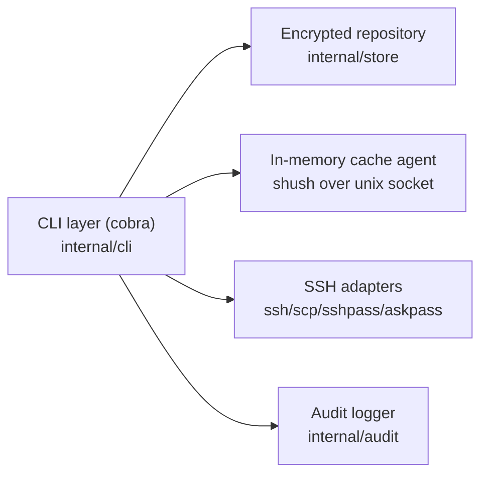
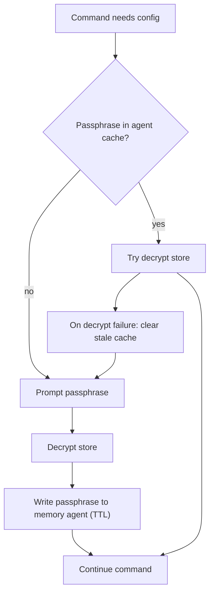
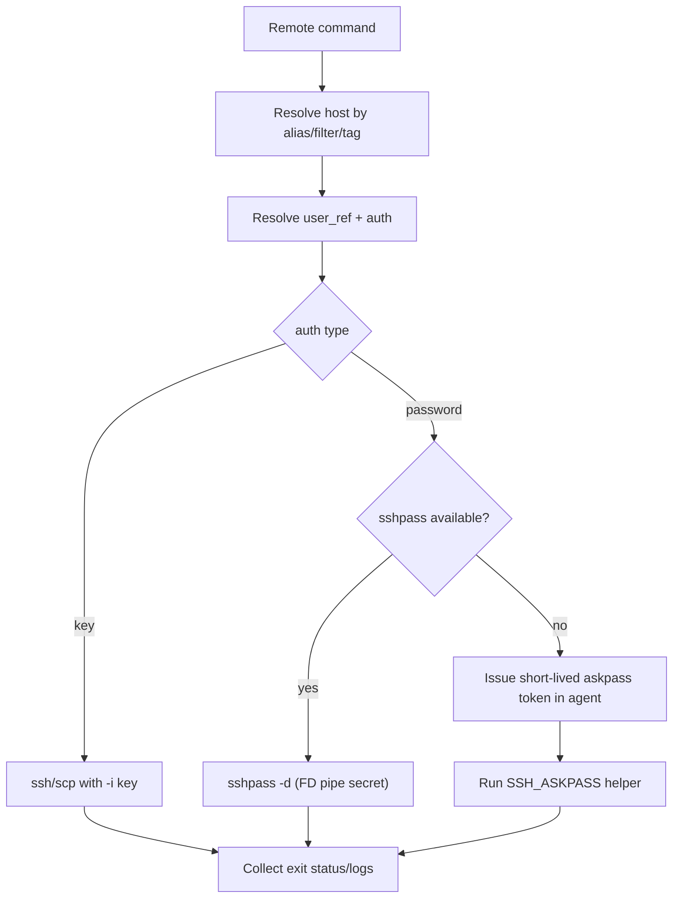

# OneSSH Architecture

This document describes the overall OneSSH design, internal module boundaries, and end-to-end execution flow.

For threat model and security controls, see [Security](/reference/security).

## 1. Design Goals

- **Single master-password UX** for encrypted host/user configuration.
- **Git-friendly encrypted storage** (`ENC[...]` fields in YAML).
- **Memory-only runtime secret cache** via local agent.
- **Unified SSH operations** (`connect`, `exec`, `cp`, `test`) over the same config model.
- **Simple local isolation model** by default (agent namespace derived from parent shell PID).

## 2. High-Level Component Map



## 3. Repository Layout (Core Modules)

- `cmd/onessh`
  - Binary entrypoint, version/build wiring.
- `internal/cli`
  - Command definitions, option parsing, command orchestration.
  - Agent protocol integration and askpass fallback logic.
  - Batch execution orchestration (`--all`, `--tag`, `--filter`, `--parallel`).
- `internal/store`
  - Config encryption/decryption, YAML persistence, KDF/cipher handling.
  - Data validation and reset safety checks.
- `internal/audit`
  - Optional audit logging and rotation.

## 4. Data Model and Persistence

Store root (default): `~/.config/onessh/data`

```text
meta.yaml
users/<alias>.yaml
hosts/<alias>.yaml
```

- `meta.yaml`: KDF parameters + password verifier.
- `users/*.yaml`: reusable user profiles (`name`, `auth`).
- `hosts/*.yaml`: target hosts (`host`, `user_ref`, `port`, `env`, hooks, tags).

Sensitive values are stored as encrypted payloads (`ENC[...]`), while file structure remains diff-friendly.

## 5. Runtime Context Resolution

For each command execution, OneSSH resolves runtime context in this order:

1. Parse CLI flags / environment variables.
2. Resolve data path.
3. Resolve agent socket:
   - explicit `--agent-socket`
   - `ONESSH_AGENT_SOCKET` / `SHUSH_SOCKET`
   - default socket derived from parent shell PID.
4. Resolve agent capability:
   - explicit `--agent-capability`
   - `ONESSH_AGENT_CAPABILITY` / `SHUSH_CAPABILITY`
   - default capability derived from `uid + parent shell PID`.
5. Build cache key namespace:
   - `onessh:passphrase:v1:<canonical-data-path>`.

## 6. Master Password and Cache Flow



Notes:

- Cache is in-memory only (agent process), not persisted to disk.
- Cache namespace is per data path, so different stores do not share passphrases accidentally.

## 7. Command Execution Architecture

Two broad command families:

1. **Configuration commands**
   - `init`, `add`, `update`, `rm`, `user *`, `passwd`, `show`, `ls`
   - Mainly operate on decrypted config model and write encrypted store back.
2. **Remote operation commands**
   - `connect` (`onessh <alias>`), `exec`, `cp`, `test`
   - Resolve host + user profile, then invoke SSH transport adapters.

### 7.1 Remote operation pipeline



### 7.2 Batch execution model

- Filters produce a deterministic alias set.
- `--parallel` bounds goroutine worker concurrency.
- Per-host result buffers are collected and printed in stable order.
- Any host failure marks overall batch result as failed.

## 8. Agent and AskPass Integration

- Agent transport: Unix domain socket (`shush`).
- Access control layers:
  - peer UID verification (agent-side),
  - optional capability token validation.
- Askpass fallback:
  - register short-lived/bounded-use token in agent,
  - helper resolves token at runtime,
  - cleanup removes token and temporary launcher script.

## 9. Lifecycle and Cleanup

- `logout`: clear current store cache entry.
- `logout --all`: clear all OneSSH passphrase namespace entries.
- `agent clear-all`: clear all agent secrets/tokens.
- command-level cleanup wipes temporary secret buffers and short-lived artifacts where applicable.

## 10. Relationship with Security Document

- This file focuses on **architecture and execution behavior**.
- [Security](/reference/security) covers **threat model, mitigations, and security limits**.
