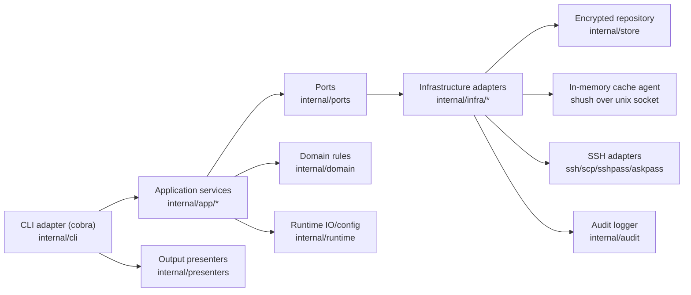
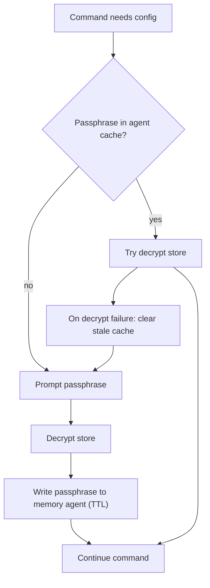
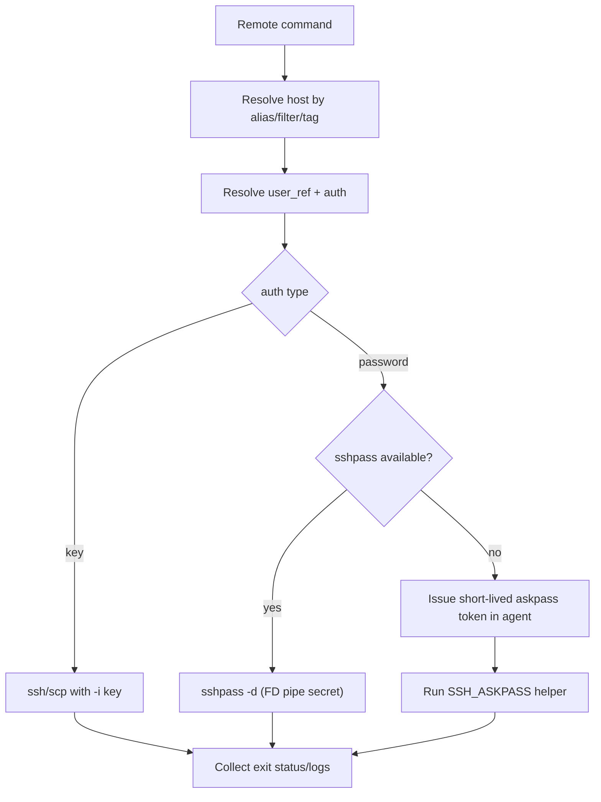

# OneSSH Architecture

This document describes the overall OneSSH design, internal module boundaries, and end-to-end execution flow.

For threat model and security controls, see [Security](/reference/security).

## 1. Design Goals

- **Single master-password UX** for encrypted host/user configuration.
- **Git-friendly encrypted storage** (`ENC[...]` fields in YAML).
- **Memory-only runtime secret cache** via local agent.
- **Unified SSH operations** (interactive `onessh <alias>`, `exec`, `cp`, `ping`) over the same config model.
- **Simple local namespacing model** by default (agent socket/capability derived from parent shell PID for convenience, not as a strong same-UID security boundary).

## 2. High-Level Component Map


```mermaid
flowchart LR
  CLI["CLI adapter (cobra)\ninternal/cli"] --> APP["Application services\ninternal/app/*"]
  CLI --> PRESENTERS["Output presenters\ninternal/presenters"]
  APP --> PORTS["Ports\ninternal/ports"]
  APP --> DOMAIN["Domain rules\ninternal/domain"]
  APP --> RUNTIME["Runtime IO/config\ninternal/runtime"]
  PORTS --> INFRA["Infrastructure adapters\ninternal/infra/*"]
  INFRA --> STORE["Encrypted repository\ninternal/store"]
  INFRA --> AGENT["In-memory cache agent\nshush over unix socket"]
  INFRA --> SSH["SSH adapters\nssh/scp/sshpass/askpass"]
  INFRA --> AUDIT["Audit logger\ninternal/audit"]
```

## 3. Repository Layout (Core Modules)

- `cmd/onessh`
  - Binary entrypoint, version/build wiring.
- `internal/cli`
  - Command definitions, option parsing, and adapter wiring.
  - Agent protocol integration and askpass fallback logic.
  - Batch command adapter wiring (`--all`, `--tag`, `--filter`, `--parallel`).
- `internal/app`
  - Use-case services for connect, exec, copy, host/user management, and shared batch behavior.
  - Owns per-operation audit decisions and keeps audit sink failures non-blocking.
- `internal/domain`
  - Pure host/user/auth/tag/default rules with no IO.
- `internal/runtime`
  - Runtime-only structures such as IO streams and audit/cache configuration.
- `internal/ports`
  - Narrow interfaces that app services depend on, such as audit and identity resolution.
- `internal/infra`
  - Adapters from ports to existing store, audit, SSH, and agent implementations.
- `internal/presenters`
  - Output formatting for tables, JSON, and batch results; no persistence or transport side effects.
- `internal/store`
  - Config encryption/decryption, YAML persistence, KDF/cipher handling.
  - Data validation and reset safety checks.
- `internal/audit`
  - Optional audit logging and rotation.

## 3.1 Layer Consistency Rules

- `domain` stays pure and deterministic. It can be used by `app`, `cli`, and tests without opening files, sockets, or processes.
- `runtime` describes per-run concerns (IO streams, cache/audit settings) and does not persist configuration.
- `app` coordinates use cases. It validates inputs, resolves identities through ports, invokes runners/adapters, and records audit outcomes through the audit port.
- `ports` define stable boundaries owned by the application layer; infrastructure implements them.
- `infra` adapts external systems and legacy implementations (`store`, audit logger, SSH/agent execution) without pushing those details back into `app`.
- `presenters` only render already-computed results. They must not load config, run SSH, mutate stores, or write audit records.
- `store` remains the encrypted persistence engine and transaction boundary for config data. Application and CLI code should go through repository/adapters instead of reimplementing persistence.

## 4. Data Model and Persistence

Store root (default): `~/.config/onessh/data`

```text
meta.yaml
users/<alias>.yaml
hosts/<alias>.yaml
```

- `meta.yaml`: KDF parameters + password verifier.
- `users/*.yaml`: reusable user profiles (`name`, `auth`).
- `hosts/*.yaml`: target hosts (`host`, `user_ref`, `port`, `proxy_jump`, `env`, `pre_connect` / `post_connect` hooks, tags).

Sensitive values are stored as encrypted payloads (`ENC[...]`), while file structure remains diff-friendly.

## 5. Runtime Context Resolution

For each command execution, OneSSH resolves runtime context in this order:

1. Parse CLI flags / environment variables.
2. Resolve data path.
3. Resolve agent socket:
   - explicit `--agent-socket`
   - `ONESSH_AGENT_SOCKET`
   - default socket derived from parent shell PID.
4. Resolve agent capability:
   - explicit `--agent-capability`
   - `ONESSH_AGENT_CAPABILITY`
   - default capability derived from `uid + parent shell PID`.
5. Build cache key namespace:
   - `onessh:passphrase:v1:<canonical-data-path>`.

## 6. Master Password and Cache Flow


```mermaid
flowchart TD
  A["Command needs config"] --> B{"Passphrase in agent cache?"}
  B -- "yes" --> C["Try decrypt store"]
  B -- "no" --> D["Prompt passphrase"]
  D --> E["Decrypt store"]
  E --> F["Write passphrase to memory agent (TTL)"]
  F --> G["Continue command"]
  C --> G
  C --> H["On decrypt failure: clear stale cache"]
  H --> D
```

Notes:

- Cache is in-memory only (agent process), not persisted to disk.
- Cache namespace is per data path, so different stores do not share passphrases accidentally.

## 7. Command Execution Architecture

Two broad command families:

1. **Configuration commands**
   - `init`, `add`, `update`, `rm`, `user *`, `passwd`, `show`, `ls`
   - Mainly operate on decrypted config model and write encrypted store back.
2. **Remote operation commands**
   - Root invocation `onessh <alias>` (interactive SSH; no `connect` subcommand), plus `exec`, `cp`, `ping`
   - Resolve host + user profile, then invoke SSH transport adapters.

### 7.1 Remote operation pipeline


```mermaid
flowchart TD
  A["Remote command"] --> B["Resolve host by alias/filter/tag"]
  B --> C["Resolve user_ref + auth"]
  C --> D{"auth type"}
  D -- "key" --> E["ssh/scp with -i key"]
  D -- "password" --> F{"sshpass available?"}
  F -- "yes" --> G["sshpass -d (FD pipe secret)"]
  F -- "no" --> H["Issue short-lived askpass token in agent"]
  H --> I["Run SSH_ASKPASS helper"]
  E --> J["Collect exit status/logs"]
  G --> J
  I --> J
```

### 7.2 Batch execution model

- Filters produce a deterministic alias set.
- `--parallel` bounds goroutine worker concurrency.
- Per-host result buffers are collected and printed in stable order.
- Any host failure marks overall batch result as failed.
- When audit logging is enabled, batch `exec`, `cp`, and `ping` record one audit event per host. Successful hosts are logged as `ok`, remote failures as `fail`, and identity-resolution skips as `skip`; audit sink errors are deliberately ignored so they do not change command results.

## 8. Agent and AskPass Integration

- Agent transport: Unix domain socket (`shush`).
- Access control layers:
  - peer UID verification (agent-side),
  - optional capability token validation.
- Askpass fallback:
  - register a short-lived, single-use token in agent,
  - helper resolves token at runtime,
  - cleanup removes token and temporary launcher script,
  - intended as a compatibility fallback, not as strong as the `sshpass -d` path.

## 9. Lifecycle and Cleanup

- `logout`: clear current store cache entry.
- `logout --all`: clear all OneSSH passphrase namespace entries.
- `agent clear-all`: clear all agent secrets/tokens.
- command-level cleanup wipes temporary secret buffers and short-lived artifacts where applicable.

## 10. Relationship with Security Document

- This file focuses on **architecture and execution behavior**.
- [Security](/reference/security) covers **threat model, mitigations, and security limits**.
