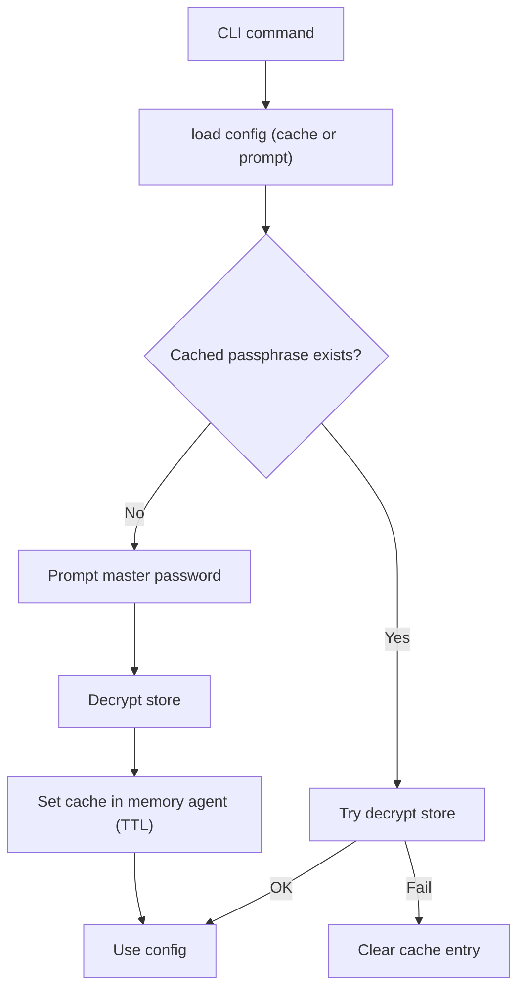
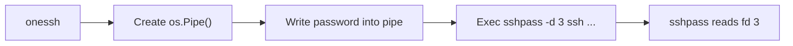
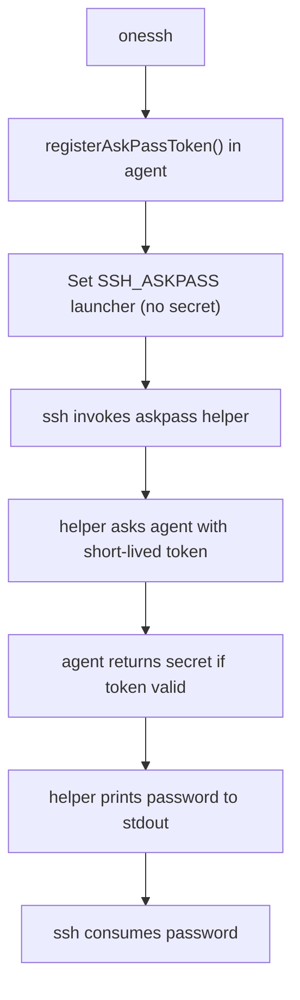

# OneSSH Security Mechanisms

This document summarizes OneSSH security design and key mitigations.
For complete architecture and runtime execution flow, see [Architecture](/reference/architecture).

## 1. Data At Rest Encryption

- KDF: Argon2id
- Cipher: AES-256-GCM
- Storage model: sharded YAML docs with encrypted sensitive fields (`ENC[...]`)
- Main files:
  - `meta.yaml` (KDF params + password verifier)
  - `users/*.yaml` (username/auth)
  - `hosts/*.yaml` (host/user_ref/port/proxy_jump/env/hooks)

### KDF hardening

KDF parameters loaded from `meta.yaml` are validated before key derivation:

- `time`: 1..10
- `memory`: 8 MiB..1 GiB (KiB in metadata)
- `threads`: 1..64
- `key_len`: must be 32
- salt length: 16..64 bytes

This blocks malicious metadata from forcing extreme resource usage.

## 2. Master Password Caching

- Cache backend: memory-only agent (no file cache compatibility).
- Cache storage: in-memory map with TTL per config path.
- Access control: Unix socket peer UID must match agent process UID.
- Optional hardening: capability token can be required on every IPC request.
- Default behavior: when not explicitly configured, socket path and capability are auto-derived from parent shell PID for convenience and namespace separation, not as a strong same-UID security boundary.

### Flow

## 3. SSH Password Auth Transport

OneSSH avoids putting SSH password in env vars.

- Preferred: `sshpass -d 3` with password through inherited FD pipe.
- Fallback: `SSH_ASKPASS` helper + onessh agent IPC token (weaker than `sshpass -d` because a local same-UID process may still race to observe the helper context).

### Preferred path (`sshpass -d`)

### Fallback path (`SSH_ASKPASS` + agent IPC token)

Token controls:

- random token generated from CSPRNG
- short TTL (10 seconds by default)
- bounded max uses (single-use by default)
- explicit cleanup after command exit

## 4. Reset Safety (`init --force`)

`SaveWithReset` path is validated before recursive deletion:

- rejects dangerous targets (empty, `/`, `.`)
- if the path exists, requires it to be a directory (non-existent paths are allowed and created)

This reduces the most obvious accidental destructive deletions caused by a wrong data path. It does **not** verify OneSSH store shape (`meta.yaml`, `users`, `hosts`) or reject extra entries inside the target directory.

## 5. Design Trade-offs

### Nonce randomization and Git diff noise

Every `Save` regenerates a fresh random nonce for each AES-256-GCM encryption
(the cryptographic recommendation; nonce reuse under the same key destroys
GCM's confidentiality and authenticity). As a result the encrypted byte
sequence in `users/*.yaml` and `hosts/*.yaml` changes on every write, even
when no semantic field has changed. Committing the OneSSH store to a public
Git repository will therefore show large byte-level diffs.

This is an intentional trade-off: cryptographic correctness is prioritized
over diff stability. If diff readability matters, prefer a file-level
commit hook or squash strategy. **Do not** try to "stabilize" the nonce by
deriving it from the plaintext or a counter stored in the repo — building a
sound deterministic-nonce scheme on top of GCM is subtle and easy to get
wrong, and any mistake collapses GCM's security.

### Master password in-memory wiping limitations

OneSSH zeroes `[]byte` master-password buffers when the call that needs the
password returns (typically via `defer wipe(...)`), which keeps the window
short but means a buffer can still be alive while a command runs. Go's
`string` is immutable and the runtime gives no API to overwrite its backing
storage. The moment a password
is converted to `string` (for example to put it inside a struct field or to
pass to a library that expects `string`), a heap copy is created that lives
until garbage collection — and even then, no zeroization is guaranteed.

We minimize the `string` exposure window in code paths that accept the
master password from the prompt, but a complete wipe of every byte that
once held the password is not achievable in pure Go. Treat process-memory
inspection by a same-UID adversary as out of scope for this layer.

## 6. Current Threat Model Notes

Mitigated:

- disk leakage of cached master password (no file cache backend)
- cross-UID socket access to memory agent
- env-var leakage of SSH password in normal paths
- accidental plain dump leakage (default redaction)
- KDF parameter abuse from tampered metadata

Still in scope / limitations:

- same-UID local malware is still powerful
- default parent-PID-derived socket/capability values are not intended to provide strong isolation from other same-UID processes
- SSH password auth inherently has higher exposure risk than key auth
- `SSH_ASKPASS` fallback is a weaker compatibility path than `sshpass -d`
- Windows equivalent of peer-credential checks needs dedicated implementation
