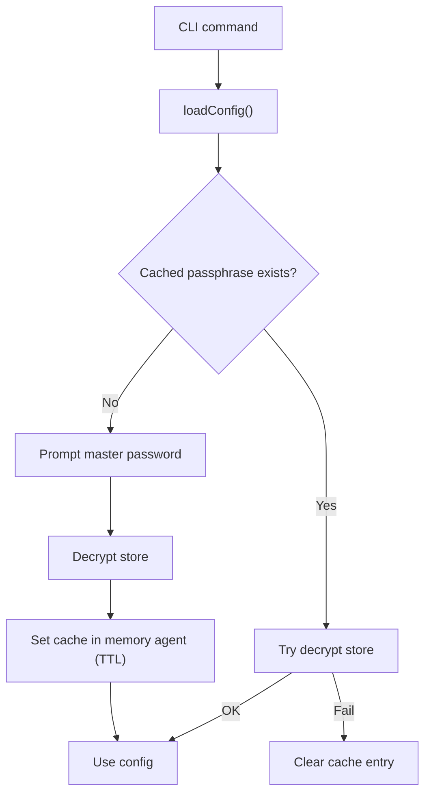
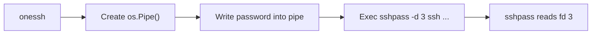
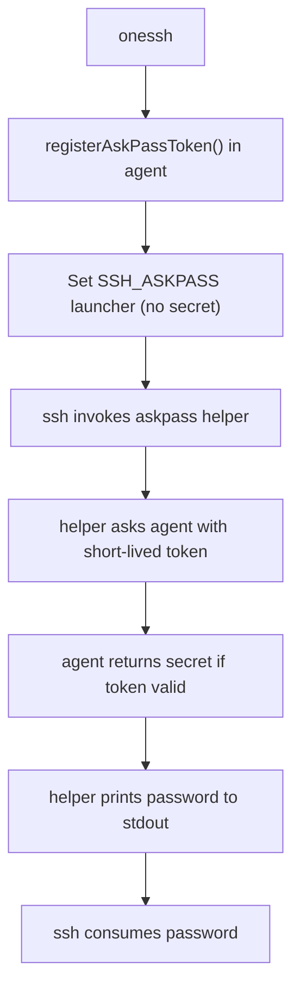

# OneSSH Security Mechanisms

This document summarizes the current security design, execution flow, and key mitigations.

## 1. Data At Rest Encryption

- KDF: Argon2id
- Cipher: AES-256-GCM
- Storage model: sharded YAML docs with encrypted sensitive fields (`ENC[...]`)
- Main files:
  - `meta.yaml` (KDF params + password verifier)
  - `users/*.yaml` (username/auth)
  - `hosts/*.yaml` (host/user_ref/env/hooks)

### KDF hardening

KDF parameters loaded from `meta.yaml` are validated before key derivation:

- `time`: 1..10
- `memory`: 8 MiB..1 GiB (KiB in metadata)
- `threads`: 1..64
- `key_len`: must be 32
- salt length: 16..64 bytes

This blocks malicious metadata from forcing extreme resource usage.

## 2. Master Password Caching

- Cache backend: memory-only agent (no file cache compatibility).
- Cache storage: in-memory map with TTL per config path.
- Access control: Unix socket peer UID must match agent process UID.
- Optional hardening: capability token can be required on every IPC request.

### Flow

## 3. SSH Password Auth Transport

OneSSH avoids putting SSH password in env vars.

- Preferred: `sshpass -d 3` with password through inherited FD pipe.
- Fallback: `SSH_ASKPASS` helper + onessh agent IPC token.

### Preferred path (`sshpass -d`)

### Fallback path (`SSH_ASKPASS` + agent IPC token)

Token controls:

- random token generated from CSPRNG
- short TTL
- bounded max uses
- explicit cleanup after command exit

## 4. Dump Command Safety

- `onessh dump` is redacted by default.
- Passwords and host env values are replaced with `[REDACTED]`.
- `--show-secrets` is required for full plaintext output.

## 5. Reset Safety (`init --force`)

`SaveWithReset` path is validated before recursive deletion:

- rejects dangerous targets (`/`, empty, `.`)
- requires directory type
- for non-empty directories, requires OneSSH store shape (`meta.yaml`, `users`, `hosts`)
- rejects unexpected extra entries

This reduces accidental destructive deletions caused by wrong config path.

## 6. Current Threat Model Notes

Mitigated:

- disk leakage of cached master password (no file cache backend)
- cross-UID socket access to memory agent
- accidental same-UID misuse when capability token is enabled
- env-var leakage of SSH password in normal paths
- accidental plain dump leakage (default redaction)
- KDF parameter abuse from tampered metadata

Still in scope / limitations:

- same-UID local malware is still powerful
- SSH password auth inherently has higher exposure risk than key auth
- Windows equivalent of peer-credential checks needs dedicated implementation
