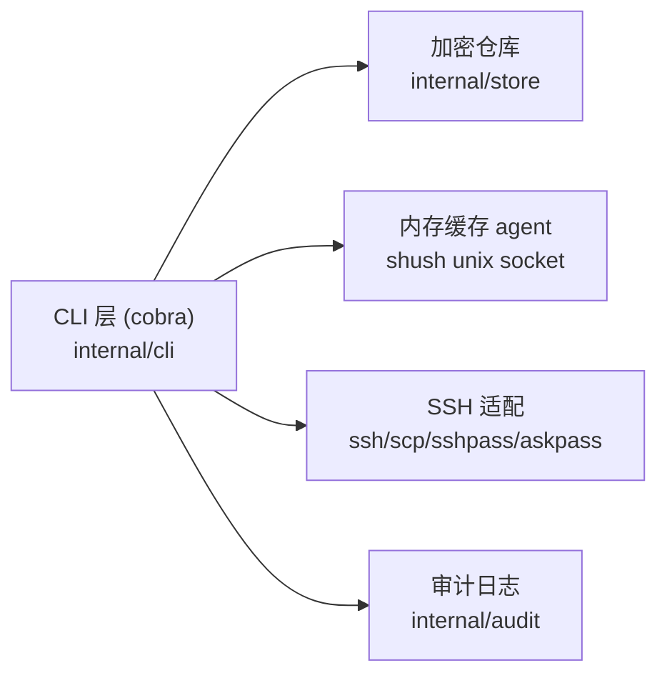
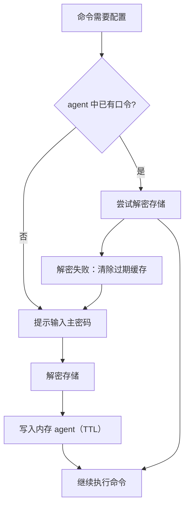
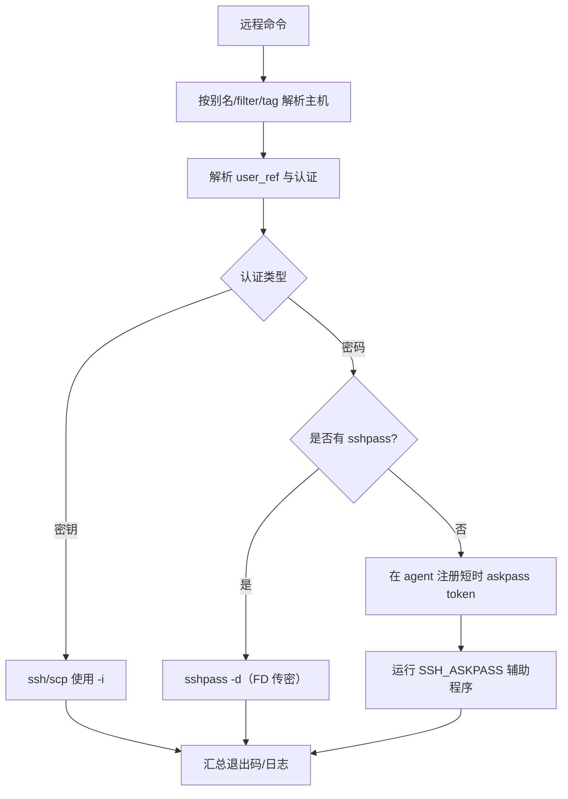

# OneSSH 架构

本文说明 OneSSH 的整体设计、模块边界与端到端执行流程。

威胁模型与安全控制见 [安全](/zh/reference/security)。

## 1. 设计目标

- **单一主密码体验**：主机与用户配置均加密存储。
- **适合 Git 的加密存储**（YAML 中的 `ENC[...]` 字段）。
- **仅内存的运行时密钥缓存**（本地 agent）。
- **统一的 SSH 操作**（交互式 `onessh <alias>`、`exec`、`cp`、`test`，同一配置模型）。
- **默认简单的本地命名空间区分**（agent 套接字/capability 由父 shell PID 派生，偏便利性设计，不是同 UID 下的强安全边界）。

## 2. 高层组件关系



## 3. 仓库布局（核心模块）

- `cmd/onessh`
  - 二进制入口、版本与构建信息。
- `internal/cli`
  - 命令定义、参数解析、编排。
  - Agent 协议与 askpass 回退逻辑。
  - 批量执行（`--all`、`--tag`、`--filter`、`--parallel`）。
- `internal/store`
  - 配置加解密、YAML 持久化、KDF/密码处理。
  - 数据校验与强制重置安全检查。
- `internal/audit`
  - 可选审计日志与轮转。

## 4. 数据模型与持久化

存储根目录（默认）：`~/.config/onessh/data`

```text
meta.yaml
users/<alias>.yaml
hosts/<alias>.yaml
```

- `meta.yaml`：KDF 参数与密码校验。
- `users/*.yaml`：可复用用户 profile（`name`、`auth`）。
- `hosts/*.yaml`：目标主机（`host`、`user_ref`、`port`、`proxy_jump`、`env`、`pre_connect` / `post_connect` 钩子、标签）。

敏感值为加密载荷（`ENC[...]`），文件结构仍便于 diff。

## 5. 运行时上下文解析

每次执行命令时，OneSSH 按以下顺序解析上下文：

1. 解析 CLI 标志与环境变量。
2. 解析数据路径。
3. 解析 agent 套接字：
   - 显式 `--agent-socket`
   - `ONESSH_AGENT_SOCKET`
   - 默认由父 shell PID 派生的套接字。
4. 解析 agent capability：
   - 显式 `--agent-capability`
   - `ONESSH_AGENT_CAPABILITY`
   - 默认由 `uid + 父 shell PID` 派生。
5. 构建缓存键命名空间：`onessh:passphrase:v1:<canonical-data-path>`。

## 6. 主密码与缓存流程



说明：

- 缓存在内存中（agent 进程），不落盘。
- 缓存按数据路径隔离，不同存储不会误共享口令。

## 7. 命令执行架构

两大类命令：

1. **配置类命令**
   - `init`、`add`、`update`、`rm`、`user *`、`passwd`、`show`、`ls`
   - 主要在解密后的模型上操作，再写回加密存储。
2. **远程操作类命令**
   - 根命令 `onessh <alias>`（交互式 SSH；无 `connect` 子命令），以及 `exec`、`cp`、`test`
   - 解析主机与用户 profile 后，调用 SSH 传输适配层。

### 7.1 远程操作流水线



### 7.2 批量执行模型

- 过滤器产生确定的别名集合。
- `--parallel` 限制 goroutine 并发度。
- 按主机收集结果，以稳定顺序输出。
- 任一主机失败则整批视为失败。

## 8. Agent 与 AskPass 集成

- Agent 传输：Unix 域套接字（`shush`）。
- 访问控制：
  - agent 端校验对端 UID；
  - 可选 capability token 校验。
- Askpass 回退：
  - 在 agent 注册短时、单次使用 token；
  - 运行时由辅助程序解析 token；
  - 结束后清理 token 与临时启动脚本；
  - 这是兼容性回退路径，安全性弱于 `sshpass -d`。

## 9. 生命周期与清理

- `logout`：清除当前存储的缓存项。
- `logout --all`：清除所有 OneSSH 口令命名空间项。
- `agent clear-all`：清除 agent 内全部密钥与 token。
- 命令级清理会擦除临时密钥缓冲区与短时产物（如适用）。

## 10. 与安全文档的关系

- 本文侧重**架构与执行行为**。
- [安全](/zh/reference/security) 侧重**威胁模型、缓解措施与安全边界**。
