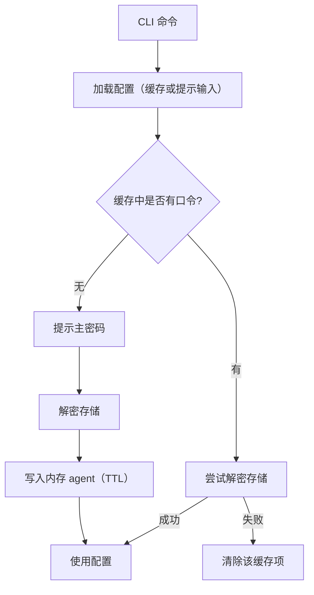
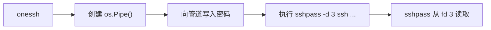
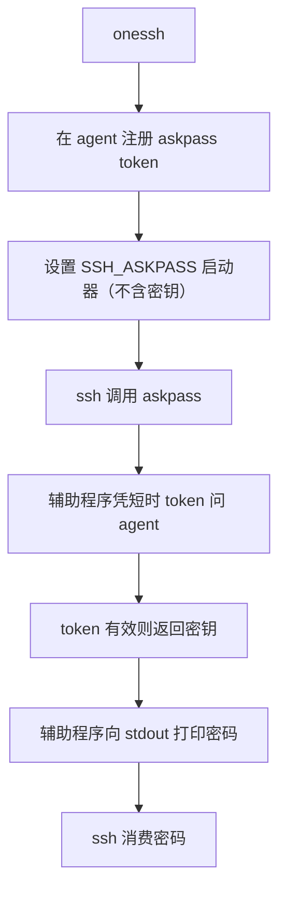

# OneSSH 安全机制

本文概述 OneSSH 的安全设计与主要缓解措施。完整架构与运行时流程见 [架构](/zh/reference/architecture)。

## 1. 静态数据加密

- KDF：Argon2id
- 密码：AES-256-GCM
- 存储：分片 YAML，敏感字段为 `ENC[...]`
- 主要文件：
  - `meta.yaml`（KDF 参数与密码校验）
  - `users/*.yaml`（用户名/认证）
  - `hosts/*.yaml`（主机/user_ref/端口/proxy_jump/环境/钩子）

### KDF 参数校验

从 `meta.yaml` 读取的 KDF 参数在派生前会校验：

- `time`：1..10
- `memory`：8 MiB..1 GiB（元数据中为 KiB）
- `threads`：1..64
- `key_len`：必须为 32
- salt 长度：16..64 字节

可防止被篡改的元数据迫使极端资源消耗。

## 2. 主密码缓存

- 后端：仅内存 agent（无文件缓存兼容路径）。
- 存储：按配置路径分 TTL 的内存映射。
- 访问控制：Unix 套接字对端 UID 须与 agent 进程 UID 一致。
- 可选加固：每次 IPC 可要求 capability token。
- 默认隔离：未显式配置时，套接字路径与 capability 由父 shell PID 派生。

### 流程

## 3. SSH 密码认证传输

OneSSH 避免将 SSH 密码放入环境变量。

- 优先：`sshpass -d 3`，通过继承的管道 FD 传密。
- 回退：`SSH_ASKPASS` 辅助程序 + onessh agent IPC token。

### 优先路径（`sshpass -d`）

### 回退路径（`SSH_ASKPASS` + agent token）

Token 控制：

- 使用 CSPRNG 生成随机 token；
- 短 TTL；
- 限制最大使用次数；
- 命令结束后显式清理。

## 4. 重置安全（`init --force`）

在递归删除前会校验 `SaveWithReset` 路径：

- 拒绝危险目标（`/`、空、`.`）；
- 要求目标为目录；
- 对非空目录，要求具备 OneSSH 存储形态（`meta.yaml`、`users`、`hosts`）；
- 拒绝意外多余条目。

降低因错误配置路径导致误删的风险。

## 5. 当前威胁模型说明

已缓解：

- 主密码磁盘缓存泄露（无文件缓存后端）；
- 跨 UID 访问内存 agent 套接字；
- 启用 capability 时同 UID 的误用；
- 常规路径下 SSH 密码经环境变量泄露；
- 意外明文导出（默认脱敏）；
- 被篡改元数据滥用 KDF 参数。

仍在范围内 / 局限：

- 同 UID 本地恶意软件仍具高权限；
- SSH 密码认证相对密钥认证暴露面更大；
- Windows 上对端凭证检查需专门实现。
