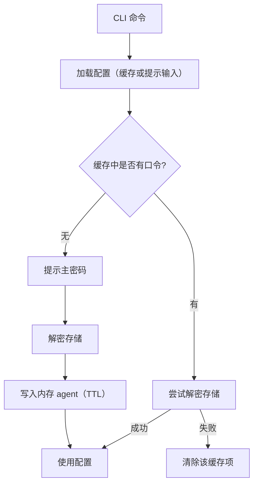
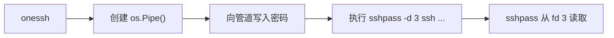
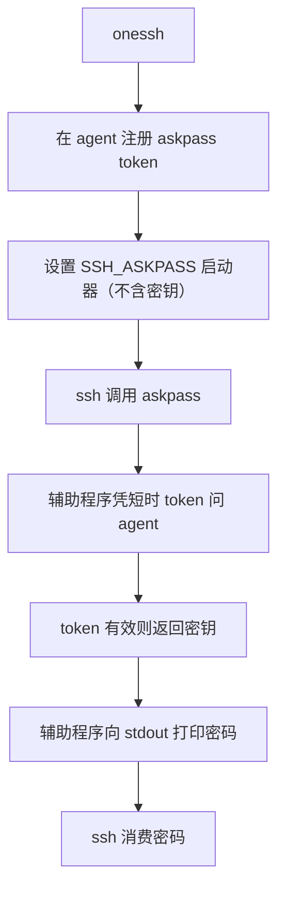

# OneSSH 安全机制

本文概述 OneSSH 的安全设计与主要缓解措施。完整架构与运行时流程见 [架构](/zh/reference/architecture)。

## 1. 静态数据加密

- KDF：Argon2id
- 密码：AES-256-GCM
- 存储：分片 YAML，敏感字段为 `ENC[...]`
- 主要文件：
  - `meta.yaml`（KDF 参数与密码校验）
  - `users/*.yaml`（用户名/认证）
  - `hosts/*.yaml`（主机/user_ref/端口/proxy_jump/环境/钩子）

### KDF 参数校验

从 `meta.yaml` 读取的 KDF 参数在派生前会校验：

- `time`：1..10
- `memory`：8 MiB..1 GiB（元数据中为 KiB）
- `threads`：1..64
- `key_len`：必须为 32
- salt 长度：16..64 字节

可防止被篡改的元数据迫使极端资源消耗。

## 2. 主密码缓存

- 后端：仅内存 agent（无文件缓存兼容路径）。
- 存储：按配置路径分 TTL 的内存映射。
- 访问控制：Unix 套接字对端 UID 须与 agent 进程 UID 一致。
- 可选加固：每次 IPC 可要求 capability token。
- 默认命名空间区分：未显式配置时，套接字路径与 capability 由父 shell PID 派生，便于不同终端默认使用不同 agent。
- 该默认行为主要用于降低误连到其他终端 agent 的概率，不应视为同 UID 本地对手下的强安全边界。

### 流程

```mermaid
flowchart TD
  A["CLI 命令"] --> B["加载配置（缓存或提示输入）"]
  B --> C{"缓存中是否有口令?"}
  C -- "有" --> D["尝试解密存储"]
  D -- "成功" --> E["使用配置"]
  D -- "失败" --> F["清除该缓存项"]
  C -- "无" --> G["提示主密码"]
  G --> H["解密存储"]
  H --> I["写入内存 agent（TTL）"]
  I --> E
```

## 3. SSH 密码认证传输

OneSSH 避免将 SSH 密码放入环境变量。

- 优先：`sshpass -d 3`，通过继承的管道 FD 传密。
- 回退：`SSH_ASKPASS` 辅助程序 + onessh agent IPC token。
- 该回退路径仅作为兼容机制；虽然 token 为短时且限次，但仍弱于 `sshpass -d`。

### 优先路径（`sshpass -d`）

```mermaid
flowchart LR
  A["onessh"] --> B["创建 os.Pipe()"]
  B --> C["向管道写入密码"]
  C --> D["执行 sshpass -d 3 ssh ..."]
  D --> E["sshpass 从 fd 3 读取"]
```

### 回退路径（`SSH_ASKPASS` + agent token）

```mermaid
flowchart TD
  A["onessh"] --> B["在 agent 注册 askpass token"]
  B --> C["设置 SSH_ASKPASS 启动器（不含密钥）"]
  C --> D["ssh 调用 askpass"]
  D --> E["辅助程序凭短时 token 问 agent"]
  E --> F["token 有效则返回密钥"]
  F --> G["辅助程序向 stdout 打印密码"]
  G --> H["ssh 消费密码"]
```

Token 控制：

- 使用 CSPRNG 生成随机 token；
- 短 TTL（默认 10 秒）；
- 限制最大使用次数（默认单次使用）；
- 命令结束后显式清理。

## 4. 重置安全（`init --force`）

在递归删除前会校验 `SaveWithReset` 路径：

- 拒绝危险目标（空、`/`、`.`）；
- 若目标已存在，要求其为目录（不存在的路径允许创建）。

仅能降低因错误数据路径导致的明显误删风险。**不会**校验 OneSSH 存储结构（`meta.yaml`、`users`、`hosts`），也**不会**拒绝目标目录中已有的多余条目。

## 5. 设计权衡

### Nonce 随机化与 Git diff 噪声

每次 `Save` 都会为 AES-256-GCM 加密重新生成随机 nonce(这是密码学推荐做法;
在同一密钥下复用 nonce 会摧毁 GCM 的机密性与完整性)。因此即使语义字段未变,
`users/*.yaml` 与 `hosts/*.yaml` 中的密文每次写入都会改变。把 OneSSH 存储
提交到公开 Git 仓库时,会看到大量字节级 diff。

这是有意为之的权衡:**密码学正确性优先于 diff 美观度**。如果对 diff 可读性
敏感,可以使用 file-level commit hook 或 squash 策略来收敛。**不要**通过
从明文或仓库中的计数器派生"稳定 nonce"来美化 diff —— 在 GCM 之上构造正确
的确定性 nonce 方案非常微妙、易踩坑,任何错误都会瓦解 GCM 的安全性。

### 主密码内存擦除的局限

OneSSH 在加解密边界一旦不再使用 `[]byte` 主密码缓冲,会立即将其清零。但
Go 的 `string` 是不可变值,运行时没有 API 可以覆盖其底层存储。一旦密码被
转换为 `string`(例如赋值到结构体字段、或传给只接受 `string` 的库),就会
在堆上产生一份副本,该副本一直存在到被 GC 回收 —— 即使 GC 后也不保证清零。

在接受主密码输入的代码路径上,我们尽量缩短 `string` 暴露窗口,但**无法在
纯 Go 中**完整擦除曾经持有过密码的所有字节。请将"同 UID 的进程内存检查"
视为本层不在防御范围内。

## 6. 当前威胁模型说明

已缓解：

- 主密码磁盘缓存泄露（无文件缓存后端）；
- 跨 UID 访问内存 agent 套接字；
- 启用 capability 时同 UID 的误用；
- 常规路径下 SSH 密码经环境变量泄露；
- 意外明文导出（默认脱敏）；
- 被篡改元数据滥用 KDF 参数。

仍在范围内 / 局限：

- 同 UID 本地恶意软件仍具高权限；
- 默认基于父 shell PID 派生的 socket/capability 主要用于命名空间区分，不应视为同 UID 场景下的强安全边界；
- SSH 密码认证相对密钥认证暴露面更大；
- `SSH_ASKPASS` 回退路径只是兼容机制，安全性弱于 `sshpass -d`；
- Windows 上对端凭证检查需专门实现。
